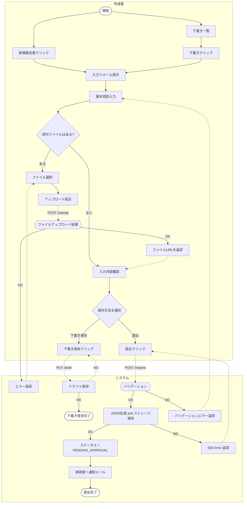

```mermaid
flowchart TD
  subgraph 作成者
    A0([開始]) --> A1["新規報告書クリック"]
    A0 --> D0["下書き一覧"]
    D0 --> D1["下書きクリック"]
    A1 --> A2["入力フォーム表示"]
    D1 --> A2
    A2 --> A3["基本項目入力"]
    A3 --> A4{"添付ファイルはある?"}
    A4 -- ある --> A5["ファイル選択"]
    A5 --> A6["アップロード指示"]
    A4 -- ない --> A7["入力内容確認"]
    A6 -.->|POST /upload| S1
    S2 -.-> A7
    A7 --> A8{"保存方法を選択"}
    A8 -- 下書き保存 --> A9["下書き保存クリック"]
    A8 -- 提出 --> A10["提出クリック"]
  end

  subgraph システム
    S1{{ファイルアップロード結果}}
    S1 -- OK --> S2["ファイルURLを返却"]
    S1 -- NG --> S3["エラー返却"] -.-> A5
    A9 -.-> |PUT /draft| S4["ドラフト保存"]
    S4 -- OK --> S5([下書き保存完了])
    A10 -.-> |POST /reports| S6{{バリデーション}}
    S6 -- OK --> S7["JSON生成 and ストレージ保存"]
    S7 -- OK --> S8["ステータス = PENDING_APPROVAL"]
    S8 --> S9["承認者へ通知メール"]
    S9 --> S10([提出完了])
    S6 -- NG  --> S11["バリデーションエラー返却"] -.-> A3
    S7 -- NG --> S12["500 Error 返却"] -.-> A10
    S4 -.->|NG| A9
  end

  %% --- スタイル定義 ---------------------------
  classDef term fill:#fff,stroke:#333;
  class A0,S5,S10 term;
```
