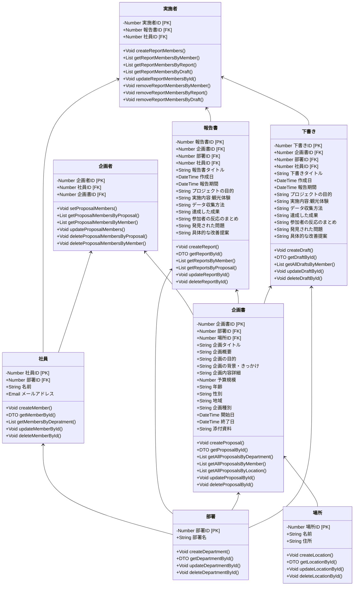

```mermaid
classDiagram
direction TB
    class 場所 {
        -Number 場所ID [PK]
        +String 名前
        +String 住所
 
        +Void createLocation()
        +DTO getLocationById()
        +Void updateLocationById()
        +Void deleteLocationById()
    }
 
    class 社員 {
        -Number 社員ID [PK]
        +Number 部署ID [FK]
        +String 名前
        +Email メールアドレス
 
        +Void createMember()
        +DTO getMemberById()
        +List getMembersByDepratment()
        +Void updateMemberById()
        +Void deleteMemberById()
    }
 
    class 企画書 {
        -Number 企画書ID [PK]
        +Number 部署ID [FK]
        +Number 場所ID [FK]
        +String 企画タイトル
        +String 企画概要
        +String 企画の目的
        +String 企画の背景・きっかけ
        +String 企画内容詳細
        +Number 予算規模
        +String 年齢
        +String 性別
        +String 地域
        +String 企画種別
        +DateTime 開始日
        +DateTime 終了日
        +String 添付資料
       
        +Void createProposal()
        +DTO getProposalById()
        +List getAllProposalsByDepartment()
        +List getAllProposalsByMember()
        +List getAllProposalsByLocation()
        +Void updateProposalById()
        +Void deleteProposalById()
    }
 
    class 企画者 {
        -Number 企画者ID [PK]
        +Number 社員ID [FK]
        +Number 企画書ID [FK]
       
        +Void setProposalMembers()
        +List getProposalMembersByProposal()
        +List getProposalMembersByMember()
        +Void updateProposalMembers()
        +Void deleteProposalMembersByProposal()
        +Void deleteProposalMembersByMember()
    }
 
    class 報告書 {
        -Number 報告書ID [PK]
        +Number 企画書ID [FK]
        +Number 部署ID [FK]
        +Number 社員ID [FK]
        +String 報告書タイトル
        +DateTime 作成日
        +DateTime 報告期間
        +String プロジェクトの目的
        +String 実施内容:観光体験
        +String データ収集方法
        +String 達成した成果
        +String 参加者の反応のまとめ
        +String 発見された問題
        +String 具体的な改善提案
       
        +Void createReport()
        +DTO getReportById()
        +List getReportsByMember()
        +List getReportsByProposal()
        +Void updateReportById()
        +Void deleteReportById()
    }
 
    class 下書き {
        -Number 下書きID [PK]
        +Number 企画書ID [FK]
        +Number 部署ID [FK]
        +Number 社員ID [FK]
        +String 下書きタイトル
        +DateTime 作成日
        +DateTime 報告期間
        +String プロジェクトの目的
        +String 実施内容:観光体験
        +String データ収集方法
        +String 達成した成果
        +String 参加者の反応のまとめ
        +String 発見された問題
        +String 具体的な改善提案
 
        +Void createDraft()
        +DTO getDraftById()
        +List getAllDraftsByMember()
        +Void updateDraftById()
        +Void deleteDraftById()
    }
 
    class 実施者 {
        -Number 実施者ID [PK]
        +Number 報告書ID [FK]
        +Number 社員ID [FK]
       
        +Void createReportMembers()
        +List getReportMembersByMember()
        +List getReportMembersByReport()
        +List getReportMembersByDraft()
        +Void updateReportMembersById()
        +Void removeReportMembersByMember()
        +Void removeReportMembersByReport()
        +Void removeReportMembersByDraft()
    }
 
    class 部署 {
        -Number 部署ID [PK]
        +String 部署名
       
        +Void createDepartment()
        +DTO getDepartmentById()
        +Void updateDepartmentById()
        +Void deleteDepartmentById()
    }
 
    社員 <-- 部署
    実施者 <-- 社員
    実施者 <-- 報告書
    実施者 <-- 下書き
    企画者 <-- 社員
    企画書 <-- 場所
    企画者 <-- 企画書
    報告書 <-- 部署
    企画書 <-- 部署
    報告書 <-- 企画書
    下書き <-- 部署
    下書き <-- 企画書
```
