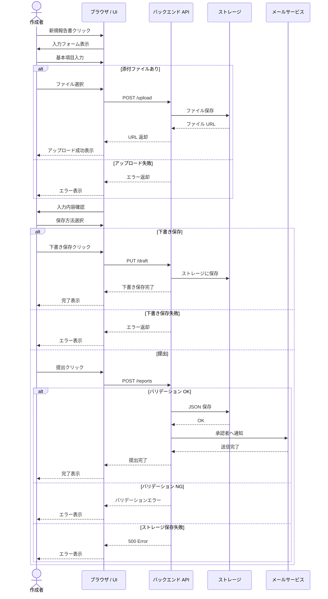

```mermaid
sequenceDiagram
    actor   User      as 作成者
    participant UI    as ブラウザ / UI
    participant API   as バックエンド API
    participant Store as ストレージ
    participant Mail  as メールサービス
    User  ->> UI  : 新規報告書クリック
    UI    ->> User: 入力フォーム表示
    User  ->> UI  : 基本項目入力
    alt 添付ファイルあり
        User  ->> UI  : ファイル選択
        UI    ->> API : POST /upload
        API   ->> Store: ファイル保存
        Store -->> API : ファイル URL
        API  -->> UI   : URL 返却
        UI   -->> User : アップロード成功表示
    else アップロード失敗
        API  -->> UI   : エラー返却
        UI   -->> User : エラー表示
    end
    UI   ->> User : 入力内容確認
    User ->> UI   : 保存方法選択
    alt 下書き保存
        User ->> UI  : 下書き保存クリック
        UI   ->> API : PUT /draft
        API  ->> Store : ストレージに保存
        API  -->> UI : 下書き保存完了
        UI   -->> User: 完了表示
    else 下書き保存失敗
        API  -->> UI   : エラー返却
        UI   -->> User : エラー表示
    else 提出
        User ->> UI  : 提出クリック
        UI   ->> API : POST /reports
        alt バリデーション OK
            API   ->> Store: JSON 保存
            Store -->> API  : OK
            API   ->> Mail : 承認者へ通知
            Mail  -->> API : 送信完了
            API  -->> UI  : 提出完了
            UI   -->> User: 完了表示
        else バリデーション NG
            API  -->> UI  : バリデーションエラー
            UI   -->> User: エラー表示
        else ストレージ保存失敗
            API  -->> UI  : 500 Error
            UI   -->> User: エラー表示
        end
    end
```
