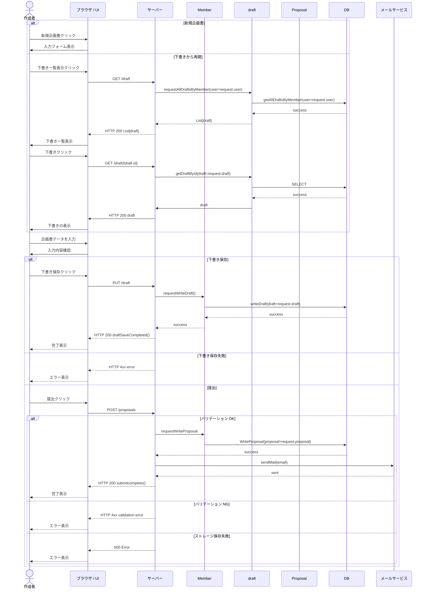

```mermaid
sequenceDiagram
    actor   User      as 作成者
    participant UI    as ブラウザ / UI
    participant Server   as サーバー
    participant Member
    participant draft
    participant Proposal
    participant DB
    participant Mail  as メールサービス
    alt 新規企画書
        User  ->> UI  : 新規企画書クリック
        UI    ->> User: 入力フォーム表示
    else 下書きから再開
        User  ->> UI  : 下書き一覧表示クリック
        UI    ->> Server: GET /draft
        Server   ->> draft:requestAllDraftsByMember(user=request.user)
        draft ->> DB:getAllDraftsByMember(user=request.user)
        DB -->> draft: success
        draft -->> Server:List[draft]
        Server -->> UI:HTTP 200 List[draft]
        UI    ->> User: 下書き一覧表示
        User  ->> UI  : 下書きクリック
        UI    ->> Server: GET /draft/{draft.id}
        Server ->> draft: getDraftById(draft=request.draft)
        draft ->> DB:SELECT
        DB -->> draft:success
        draft ->> Server: draft
        Server ->> UI:HTTP 200 draft
        UI ->> User:下書きの表示
        
    end
    User ->> UI   : 企画書データを入力
    UI   ->> User : 入力内容確認

    alt 下書き保存
        User ->> UI  : 下書き保存クリック
        UI   ->> Server : PUT /draft
        Server  ->> Member : requestWriteDraft()
        Member ->> DB:writeDraft(draft=request.draft)
        DB -->> Member:success
        Member -->> Server:success
        Server  -->> UI : HTTP 200 draftSaveCompleted()
        UI   -->> User: 完了表示
    else 下書き保存失敗
        Server  -->> UI   : HTTP 4xx error
        UI   -->> User : エラー表示
    else 提出
        User ->> UI  : 提出クリック
        UI   ->> Server : POST /proposals
        alt バリデーション OK
            Server   ->> Member:requestWriteProposal
            Member ->> DB: WriteProposal(proposal=request.proposal)
            DB -->> Server  : success
            Server   ->> Mail : sendMail(email)
            Mail  -->> Server : sent
            Server  -->> UI  : HTTP 200 submitcomplete()
            UI   -->> User: 完了表示
        else バリデーション NG
            Server  -->> UI  : HTTP 4xx validation error
            UI   -->> User: エラー表示
        else ストレージ保存失敗
            Server  -->> UI  : 500 Error
            UI   -->> User: エラー表示
        end
    end
```
